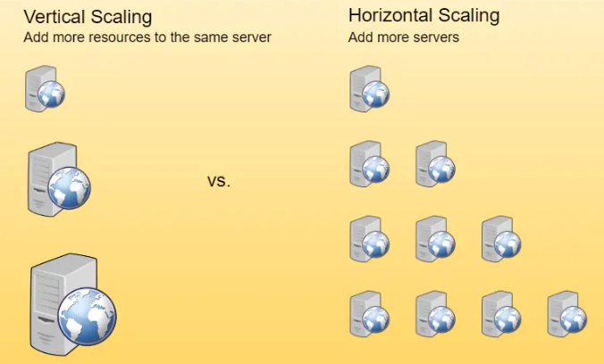
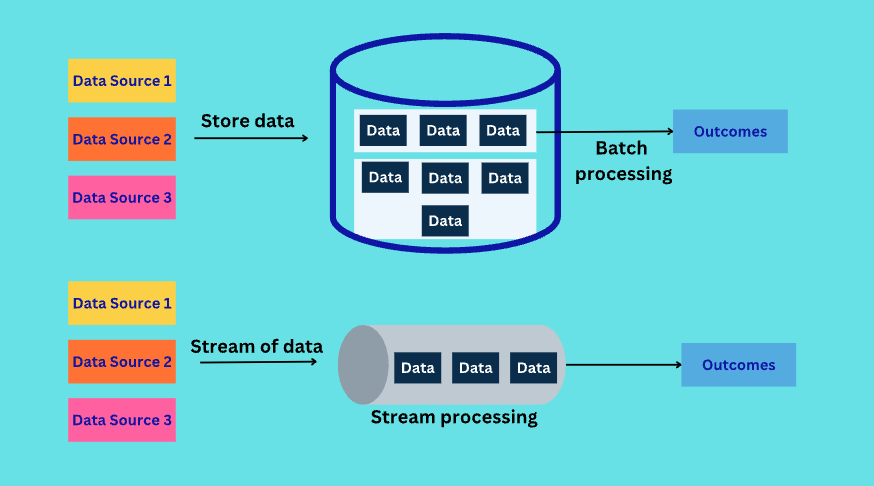
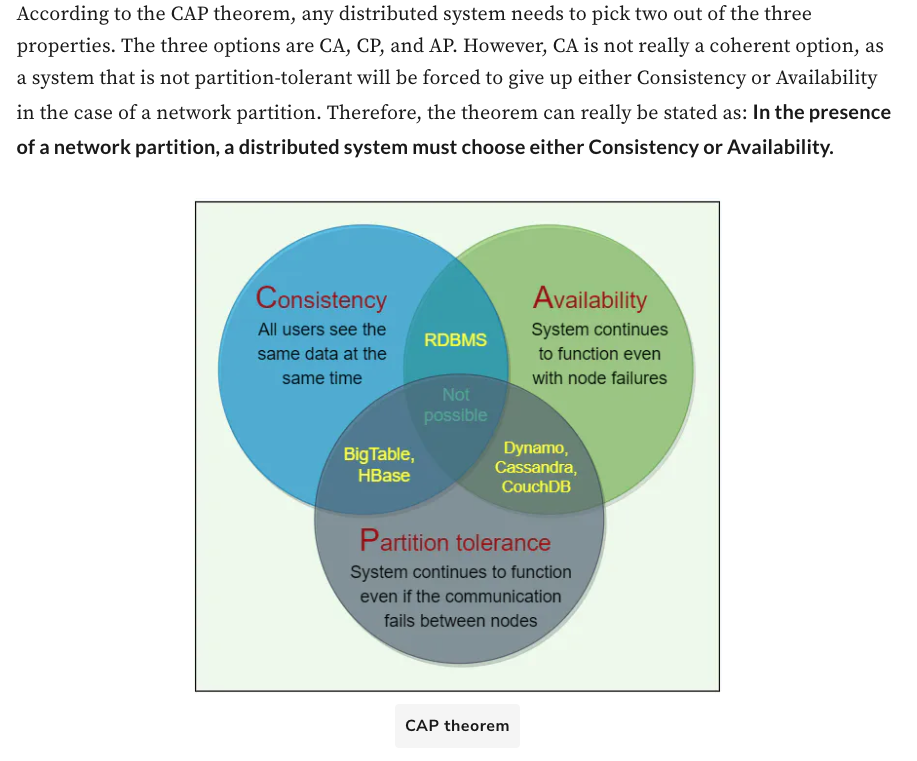
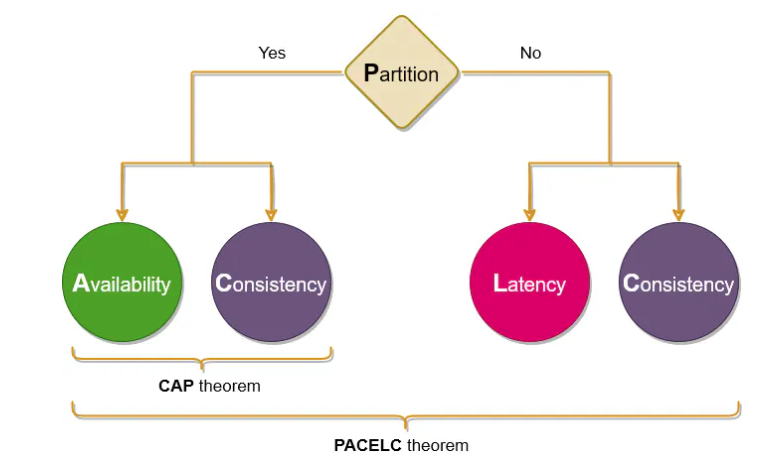

# System Design Primer

Introduction: 

### Requirements gathering

- Functional requirements. What the system needs to do.
    - Ex) For Design a News Feed.. Be able to GET the news feed, post to the news feed, etc
- Scale. As this drives the non-functional requirements.
- Non-functional requirements. System characteristics.
    - Ex) Scalability, availability, reliability, consistency, low latency.
    - It’s important to know that different parts (or services) within your system can have different  characteristics. For example, a bank account can be highly available for viewing you bank account but priotize consistency when writing to the DB.

### System characteristics

- **Scalability**: Scalability is the capability of a system, process, or a network to grow and manage increased demand. Any distributed system that can continuously evolve in order to support the growing amount of work is considered to be scalable.
- **Reliability (fault tolerant)?**: Reliability refers to the ability of a system to continue operating correctly and effectively in the presence of faults, errors, or failures. In simple terms, a distributed system is considered reliable if it keeps delivering its services even when one or several of its software or hardware components fail.
    - Remove single point of failures. Think about how systems can reboot… Have replicas or save to memory.
    - **Example**. If a user has added an item to their shopping cart, the system is expected not to lose it.
- **Availability:** Availability is the time a system remains operational to perform its required function in a specific period of time. It is a simple measure of the percentage of time that a system, service, or a machine remains operational under normal conditions.
    - **Example**. An aircraft that can be flown for many hours a month without much downtime can be said to have a high availability. If an aircraft is down for maintenance and no-one can use it, it’s considered not-available during that time.
    - If a system is reliable, it is available.. But not the other way around. You can make something available by just keeping it up as long as possible but it can have no redundancy and no fault tolerence.
- **Efficiency:**
    - Latency: Response times.. For a server request that means, how fast does it take to send a request and get back the response.
    - Throughput (or bandwidth): How many things can something process in a single unit of time.
- **Serviceability and Manageability**: Another important consideration while designing a distributed system is how easy it is to operate and maintain. Serviceability or manageability is the simplicity and speed with which a system can be repaired or maintained; if the time to fix a failed system increases, then availability will decrease.

### Simple Client-Server setup

- Usually you have a client (web application or mobile phone). (view tier)
- Client makes requests to servers. Servers respond with data or html.
- The server maintains business logic (web tier)
- The server may want to persist data. (data tier)
- It is a good idea to keep these independent so they can scale independently.
- Client and server communicate using HTTP protocol. The client finds the IP Address of the server using DNS.

## APIs

- Rest APIs
- GraphQL
- Different protocols like: HTTP, RPC, gRPC, WebSockets.

## Databases

- Usually think about SQL vs NoSQL
    - SQL (relational)
        - Traditional SQL databases (Postgres, MariaDB, etc)
        - Usually ACID compliant
        - Stores data in tables and we can join them.
        - Data is usually very structured and has to follow a **schema**.
        - Usually vertically scalable.. It’s pretty challenging and time-consuming to horizontally scale this as DB integrity (key constraints), and DB transactions were created for single servers.
    - NoSQL (non-relational database)
        - More recent DBs that focus on scalability and availability. Basically databases that are not the traditional SQL databases of tables and joins and de-normalized data. Often data here is duplicated in tables for speed.
        - We usually think of these using the CAP theorem.
        - There are multiple types of NoSQL database: Key value Store, Document stores, column stores, etc.
        - Data is less structured and can be **schema-less**.
        - Usually horizontally scalable.
- But theres other types of databases as well:
    - Graph databases: For modelling relationships
    - Vector databases: For search
- Can usually optimize databases with an ***index***. This will help speed up the reads because we don’t have to do a table scan, but it also increases write times because we have to update the indexes on every write.
    - If a database is more often written to than read from, adding an index will just slow down the most common operation which isn’t good.

## Data Partitioning

- Data partitioning is the process of dividing a large database into smaller, more manageable parts called partitions or shards. Each partition is independent and contains a subset of the overall data. You’ll need to combine all shards to get the superset.
- This usually helps with performance and scalability of the database as it spreads the load across multiple machines.
    - Horizontal Partitioning (Most common): Divide a database table into multiple partitions or shards, with each partition containing a subset of rows.
        - For example, consider a social media platform that stores user data in a database table. The platform might partition the user table horizontally based on the geographic location of the users, so that users in the United States are stored in one shard, users in Europe are stored in another shard, and so on.
        - Downside is if we choose the wrong partition key, we will get a ***hot-key*** and the server will be overloaded.
    - Vertical Partitioning:
        - Vertical data partitioning involves splitting a database table into multiple partitions or shards, with each partition containing a subset of columns.
        - For example, consider an e-commerce website that stores customer data in a table. The website might partition the customer table vertically based on the type of data, so that personal information such as name and address are stored in one shard, while order history and payment information are stored in another shard.
- Considerations:
    - When you partition a database, some operations have to be run across multiple servers. This is a challenge if you want to do things like transactions which mostly work on a single server. If you want to have transactions work on multiple servers, you have to introduce two-phase commits.

## Vertical Scaling vs Horizontal Scaling

- What do we mean by scaling?
    - Scalability is the capability of a system, process, or a network to grow and manage an increased demand. Any distributed system that can continuously evolve in order to support the growing amount of work is considered to be scalable.
    - Let’s think back to the original single server setup. If we have a lot of clients sending requests to the server, the server will become overloaded.. It will not be able to serve these requests and latency/response times will go up causing a bad experience for users.
    - To keep latency/response times low, we’ll need to “scale” our server. There are two ways to do that. Vertically and Horizontally.
- Different types of traffic:
    - Bursty traffic
    - Celebrity traffic
    - Sustained traffic
- Vertical scaling: We can scale our system by making our servers stronger.. AKA adding more CPU, RAM. Basically throwing more compute to it. The extreme end of this is having a super computer as your server.
    - Pros:
        - Easier to do (At least in the cloud). Just flip a switch.
    - Cons:
        - Having a very strong computer can be expensive and harder to get parts for/maintain. Need very specialized people to maintain it. Also it’s a single point of failure.
        - Often involves downtime
- Horizontal scaling: We can scale our system by adding more servers.
    - Cons: Have to add co-ordination between multiple servers which can get complicated.

## Load Balancer

- If we decide to horizontally scale we’ll need to add a load balancer to distribute the traffic evenly across our cluster. Clients will now talk to the load balancer and the load balancer will route the traffic to the different servers (theres different algos here).
- Clients will no longer be able to talk with the servers directly, they will talk to the load balancer. For even more security, all of the servers within the cluster can only be reachable through private IPs. This is essentially what a VPC is.
- Load balancers help with:
    - Responsiveness: Since the load is spread out across servers, each server has to do less work so will be more responsive
    - Availability: If one server goes down, we can route to one thats active and have no downtime.
    - Throughput: More servers processing tasks leads to more tasks done per unit of time.
- To utilize full scalability and redundancy (but decrease operability), we can try to balance the load at each layer in the system. We can add LBs at three places:

- Key operational considerations:
    - Health checks.. This let’s the load balancer know which servers are still alive so we can route requests to them.
    - Load balancing algo. Round Robin Method, Least Connect Method, Least Response Time Method, Least Bandwidth Method..

## Database Replication

- Database replication is when you duplicate data so that we have redundancy and to avoid a single point of failure.
    - Redundancy: If the database is deleted we have another copy somewhere else
    - No single point of failure: If one database goes down we can read/serve from the other one.
- In NoSQL databases replication usually comes out of the box.
- With SQL this usually doesn’t come out of the box. We usually use a leader/follower replication strategy. The leader accepts all WRITEs and the followers sync their data with the leader and only serve READ requests.
    - CDC (change data capture) is used to sync the leader with all of the followers.
    - This is good when there are waay more READs than WRITEs.

## Caching

- To improve response times we can introduce a “cache” to store results of expensive operations or frequently performed operations so that we can serve requests more quickly. Caching is used in almost every computing layer: hardware, operating systems, web browsers, web applications, and more.
- For static content we can use a CDN to move static elements closer to the user.
    - CDN servers cache static content like images, videos, CSS, JS, etc
- For the data tier we can use an ***in-memory*** datastore like REDIS or Memcached. This is much faster because it is in-memory (doesn’t have to read from disk which is very slow) and also doesn’t have to perform any querying logic like JOINs and stuff.
- It is important to keep data synchronized between the cache and primary storage system.There are multiple synchronization strategies:
    - Read-through. Similar to the PDF Generator or JSON generator at Nova.
        - When a read request is made the cache first checks if the data is available (cache hit).
        - If the data is not in the cache (cache miss), the cache system reads the data from the primary storage, stores it in the cache, and then returns it to the client.
        - Subsequent read requests for the same data will be served from the cache until the data expires or is evicted.
    - Write-through.
        - When a write request is made, **we write to both the database and the cache simultaneously**.
        - Read requests can be served from the cache, which contains up-to-date data.
        - Pros: Provides strong consistency between the cache and the database
        - Cons: Higher latency on writes.
    - Write-back.
    - Write-around.
- If you really care about memory you can also add a capacity on your cache. If you add capacity you will need to introduce an eviction policy: **LRU, LFU, FIFO, LIFO, etc**
- Considerations:
    - When to use a cache. If data is accessed frequently but also changed in-frequently it will be good to use a cache. If the data is changed frequently then it will be less important because the cache will be outdated every time it’s called.
    - Expiration. We don’t want keys sticking around forever, at some point we want to remove them.
        - Don’t make the expiration too short as this will cause the system to re-load data from the database too frequently.
        - If you make it too long the database will turn stale.
    - Consistency. This involves keeping the data store and the cache in sync. This can happen because data-modifying operations on the data store and cache are not in a single transaction.

## Stateless vs Stateful Web Servers

- Stateful: This is when the server maintains some knowledge about the client from one request to another. For example, it can maintain session info or even for websockets it’s maintaining a connection with the client.
    - The problem with stateful architecture is that these days clients can switch to another server. i.e. the load balancer can route requests to different servers and don’t want to just route to the same server over and over for a specific client.
- Stateless: In this model we move the stateful logic into a datastore that is shared between all severs and no longer store it on the server. That way any server can serve a clients request.

## Data-Centers

- Data-Centers are basically buildings full of servers. In AWS there are different data centers called regions (i.e. `us-west-1`, `us-east-1`, `eu-west-1` etc).
    - These data centers are strategically/geographically placed in different locations of the world. Depending on where you live, you will want to use the data center closest to you so that latency is lower because packets have a smaller distance to travel.
- In AWS data is not shared across different data centers. Replication is usually within servers within the same data center. You can make them replicate across regions tho but that can be a lot of effort.
- You can leverage regions if you have localization policies that enforces that data stay within a given country.
    - Ex) You can make all data store only on US servers and never leave the country.

## Message Queues

- Message queues allow us to decouple different components of the system so they can be scaled independently.
- Message queues have three main components:
    - The queue itself. Usually a job or message queue. ***There is a difference here*.**
    - Producers. Add jobs or messages to the queue.
        - Producers are usually Clients that are pushing logs and analytics to our BE. The only consideration here is that we don’t want to push logs one at a time as that will spam the server with network requests. Instead we can build up logs on the client and send them periodically.
    - Consumers. Grab  jobs or messages from the queue and perform some action.
        - The most ***naive*** solution here is to have a simple server that polls the message queue for messages.
        - However, there are frameworks that allow us to do this at scale such as Apache Flink.
        - After consumers process the stream they output it into the ***sink.*** The sink can be a database or even another stream.
        - Streams can also maintain a copy of the DB to enrich the stream.
        - Consumers can also join two different streams and output to another stream.

### Batch Processing and Stream Processing

- Batch Processing:
    - Batch processing refers to processing data in large, discrete blocks (batches) at scheduled intervals or after accumulating a certain amount of data.
        - Pros: Easy to implement
        - Cons: Not really suitable for real-time systems because theres a delay in processing.
- Stream Processing:
    - Stream processing involves continuously processing data in real-time as it arrives. This can be done using Kafka, Kinesis, etc.
        - Pros: Immediate insights and actions
        - Cons:
            - Generally more complex to implement and manage than batch processing
            - Can require significant resources to process data as it streams.

## Observability (Logging, metrics)

- Data Dog for performance monitoring:
    - This helps us gain business insights and understand the health status of the system.
    - P99 latency, error rates and tings like that.
- Papertrail:
    - Info, warning, and error logs that you can use to identify errors/problems with your system. Usually you want to provide context with each log so you can correlate logs to other logs and build a user journey. You also want to add information to logs that will be helpful for debugging.
- Sentry for capturing BE and FE alerts
- PagerDuty for notifying the team of the alerts

## Developer Experience..

- CI/CD
- Auto deployment
- Local dev experience
- local/dev/staging

## Database Sharding

- Sharding is when you spread your data across multiple servers. Each server only gets a subset of the data and to get the full set of data you’ll need to look across all your servers. The schema is shared across servers.
    - Watch out for the hot-key or celebrity problem which can cause a shard to become overloaded.
- NoSQL. This is kind of done out of the box since NoSQL databases are usually distributed databases (has many servers). You just need to give a write partition key so it’s spread out nicely across the cluster.
- SQL. These databases are usually single servers. You can shard the database but it increases the complexity at the application layer because you’ll need to know what shard the data is on.

## **ACID vs BASE in Databases**

- ACID and BASE are two sets of properties that represent different approaches to handling transactions in database systems. They reflect trade-offs between consistency, availability, and partition tolerance, especially in distributed systems.
    - ACID:
        - Atomicity: Ensures that a transaction is either fully completed or not executed at all. Can execute multiple operations as a single unit. Basically all or nothing, either one operation succeeds or none of them succeed.
        - Consistency: Guarantees that a transaction brings the database from one valid state to another valid state.
        - Isolation: Ensures that concurrent transactions don’t interfere with each other.
        - Durability: Once data is commited to DB, it will always be there even if the system goes down.
        - Use cases: Ideal for systems requiring high reliability and data integrity, like banking or financial systems.
    - BASE:
        - Stands for Basically Available, Soft state, and Eventual consistency. It’s an alternative to ACID in distributed systems.. Favoring availability over consistency.
        - Components:
            - Basically Available: System is available most of the time
            - Soft state: The state of the system may change over time, even without input
            - Eventual Consistency: The system will eventually become consistent, given enough time.
        - Ex) A social media platform using a BASE model may show different users different counts of likes on a post for a short period but eventually, all users will see the correct count.
        - Use cases: Suitable for distributed systems where availability and partition tolerance are more critical than immediate consistency, like social networks or e-commerce product catalogs.
    - Key differences:
        - **Consistency and Availability**: ACID prioritizes consistency and reliability of each transaction, while BASE prioritizes system availability and partition tolerance, allowing for some level of data inconsistency.
        - **System Design**: ACID is generally used in traditional relational databases, while BASE is often associated with NoSQL and distributed databases.
        - **Use Case Alignment**: ACID is well-suited for applications requiring strong data integrity, whereas BASE is better for large-scale applications needing high availability and scalability.

## CAP Theorem

**CAP theorem** states that it’s impossible for a distributed system to simultaneously provide all three of the following desirable properties:

- **Consistency (C)**: All nodes see the same data at the same time. This means users can read or write from/to any node in the system and will receive the same data. It is equivalent to having a single up-to-date copy of the data.
    - Note: This is different than ***consistency*** in ACID. In ACID consistency means maintaining primary key constraints, fkey constraints, and all other constraints at all times.
- **Availability (A)**: The systems ability to remain accessible (serve requests) even if one ore more nodes in the system do down.
- **Partition tolerance (P)**: A partition is a communication break (or a network failure) between any two nodes in the system. A partition-tolerant system continues to operate even if there are partitions in the system.

## PACELC Theorem

- The PACELC theorem states that in a system that replicated data:
    - If there is a partition (`P`), a distributed system can tradeoff between availability and consistency (i.e., `A` and `C`);
    - else (`E`), when the system is running normally in the absence of partitions, thesystem can tradeoff between latency (`L`) and consistency (`C`)

## Proxies

- **Proxy (or forward proxy)**: Essentially, a proxy server is a piece of software or hardware that facilitates the request for resources from other servers on behalf of clients, thus anonymizing the client from the server.
- Reverse proxy: A reverse proxy retrieves resources from one or more servers on behalf of a client. These resources are then returned to the client, appearing as if the originated from the proxy server itself, thus anonymizing the server.
- Basically, when you want to protect your clients on your internal network, you should put them behind a forward proxy; on the other hand, when you want to protect your servers, you should put them behind a reverse proxy.

## Redundancy and Replication

- Redundancy is the duplication of critical component or functions of a system with the intention of increasing the reliability of the system, usually in the form of a backup or fail-safe, or to improve the actual system performance. For example, we don’t want just a single copy of the data because if that copy is lost we lost the whole thing.
- Replication. Is the process of making more copies of something, thus providing some redundancy in our system. There are multiple strategies to provide redundancy:
    - Synchronous replication. This is when we want to enforce strong consistency. When changes are applied to the leader all of the followers have to acknowlede that they also applied the same change before the write is successful.
    - Asynchronous replication. This is more eventual consistency. We send the followers the changes and they will apply it when they can. The write is considered successful if the leader applied the write.
    - Semi-synchronous replication. i.e. Getting quorom.